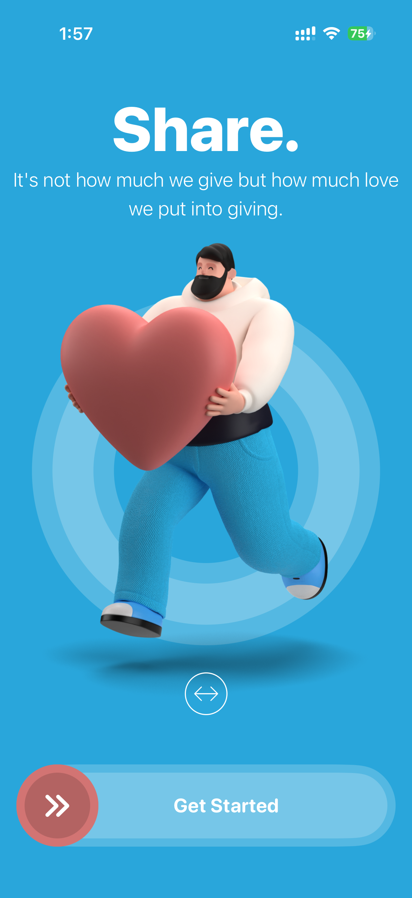
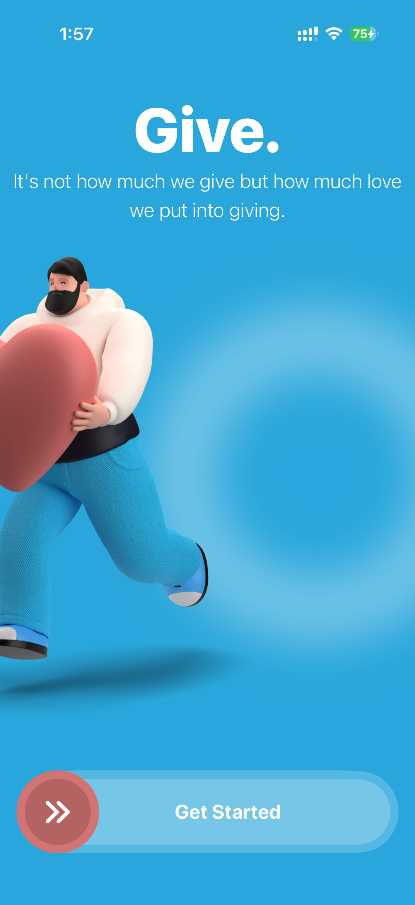
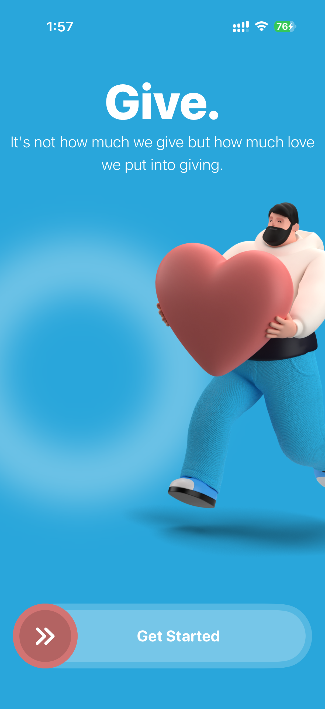
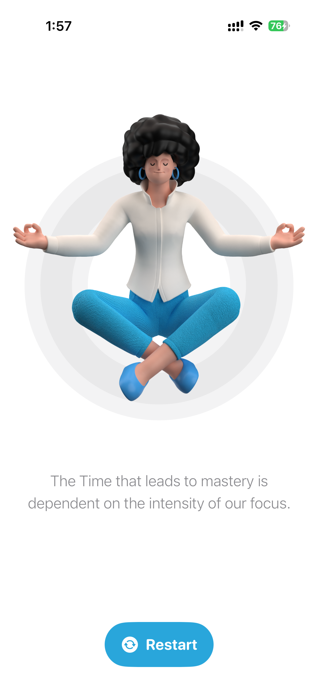

# Restart

Restart is a SwiftUI iOS app focused on motivation, calmness, and self-improvement.

The app uses a smooth onboarding experience with custom illustrations, animations, and a clean modern UI. It is designed as a beginner-friendly SwiftUI project to practice onboarding screens, drag interactions, animations, and clean app structure.

---

## Features

- Beautiful SwiftUI onboarding screen
- Drag-style “Get Started” interaction
- Motivational quote screens
- Smooth UI animations
- Restart screen after completing onboarding
- Clean and beginner-friendly SwiftUI project structure
- Custom illustrations and assets
- Simple, calm, and modern user experience

---

## 📸 Screenshots

<p align="center">
  
  
  
  
</p>

---

## 🎥 Demo Video

https://github.com/user-attachments/assets/e2a40fb2-a2c1-4e17-bb22-d355aa864604

---

## Tech Stack

- Swift
- SwiftUI
- Xcode
- iOS

---

## 📚 What I Learned

While building Restart, I learned how to create a smooth onboarding experience using SwiftUI.

This project helped me practice animations, custom UI components, drag gestures, image assets, and clean screen transitions.

I also learned how small design details like colors, spacing, icons, illustrations, and movement can make an app feel more polished and user-friendly.

---

## Project Structure

```text
Restart
├── App
├── Views
├── Components
├── Assets
└── README.md
```

---

## 📂 Repository

GitHub Repo:  
https://github.com/DhruvPatel05/Restart

---

## 👨‍💻 Author

Dhruv Patel

LinkedIn:  
https://www.linkedin.com/in/dhruv-patel-csm/

GitHub:  
https://github.com/DhruvPatel05

---

## Support

If you like this project, please consider giving it a star ⭐
